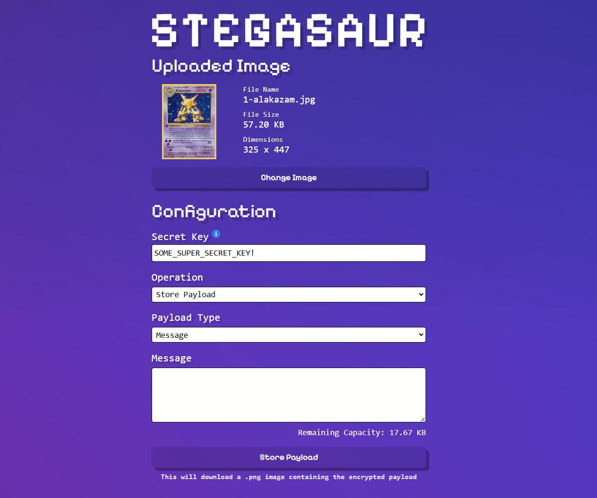

# Stegasaur

A modern web-based steganography tool that allows you to securely hide encrypted messages or files within images. Using advanced image manipulation techniques and strong encryption, Stegasaur ensures your hidden data remains undetectable to the naked eye while requiring a secret key for retrieval.

## Features

- **Secure Encryption**: Utilizes AES-CBC encryption with PBKDF2 key derivation for robust protection.
- **Steganography**: Embeds data in the least significant bits of image alpha channels.
- **Dual Payload Support**: Hide text messages or binary files (e.g., documents, images).
- **Web-Based**: No installation required—runs entirely in your browser.
- **Responsive Design**: Works seamlessly on desktop and mobile devices.
- **Real-Time Capacity Estimation**: See how much data your image can hold.
- **Download Modified Images**: Export steganographed images directly.

## How It Works

Stegasaur combines steganography (hiding data in plain sight) with cryptography (encrypting the data). The process:

1. **Encryption**: Your payload is encrypted using a user-provided secret key.
2. **Embedding**: The encrypted data is hidden in the alpha channel of the image pixels.
3. **Retrieval**: Provide the same key to decrypt and extract the hidden data.

Only those with the exact secret key can access the concealed information.

## Usage Guide

1. **Upload an Image**: Drag and drop or select a PNG image on the landing page.
2. **Configure Operation**:
   - Choose "Inject" to hide data or "Retrieve" to extract data.
   - Select payload type: Message (text) or File.
   - Enter your secret key (keep it secure and memorable).
3. **Inject Payload**:
   - For messages: Type your text.
   - For files: Select a file (check capacity limits).
   - Click "Process" to download the modified image.
4. **Retrieve Payload**:
   - Upload a steganographed image.
   - Enter the secret key.
   - Click "Process" to extract and download the hidden data.

## Security Considerations

- **Key Strength**: Use a long, complex secret key. The encryption is only as strong as your key.
- **Image Formats**: Currently supports PNG due to alpha channel usage. Other formats may be added in future updates.
- **Privacy**: All processing happens client-side—no data is sent to servers.
- **Disclaimer**: This tool is for educational and legitimate purposes only. Misuse for illegal activities is not endorsed.

## Technical Details

- **Frontend**: React 19 with TypeScript, Vite, TailwindCSS.
- **Cryptography**: Web Crypto API (AES-CBC, PBKDF2).
- **Steganography**: LSB encoding in RGBA alpha channels.
- **File Handling**: Supports various file types for embedding.

## Contributing

Contributions are welcome! Please open an issue or submit a pull request.

## License

© 2025 Stegasaur. All rights reserved.

This project is provided for educational purposes. See the disclaimer in the app for more details.
